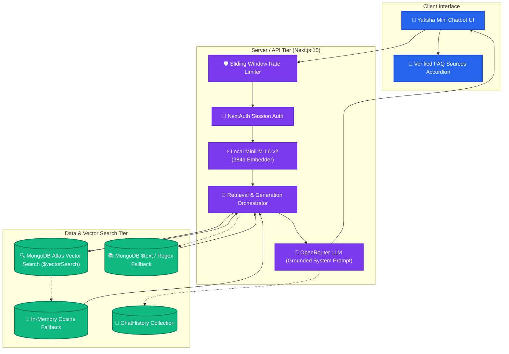

# 🎓 Yaksha Internship FAQ & Support Portal

[](https://nextjs.org/)
[](https://www.mongodb.com/)
[](https://openrouter.ai/)
[-yellow?style=flat-square&logo=huggingface&logoColor=white)](https://huggingface.co/sentence-transformers/all-MiniLM-L6-v2)
[](https://authjs.dev/)
[](https://tailwindcss.com/)
[](https://www.framer.com/motion/)

Welcome to **Yaksha FAQ & Support Portal** (`yaksha-faq`), a production-ready, feature-rich web application built from scratch to streamline onboarding, support, and query resolution for candidates of the **Vicharanashala Internship (VINS)** at **IIT Ropar**.

The platform provides interns with self-service support via advanced interactive FAQ searches, a grounded **Retrieval-Augmented Generation (RAG)** chatbot powered by **MongoDB Atlas Vector Search** and **OpenRouter**, verified source citations, and structured support query workflows.

---

## 🧠 RAG Architecture & Data Flow

Yaksha Mini uses a strict, fully grounded Retrieval-Augmented Generation pipeline designed to answer questions strictly from retrieved FAQ documents without inventing facts or hallucinating.



---

## ⚡ Core Features

### 1. Grounded RAG Chatbot ("Yaksha Mini")
- **384-dimensional Embeddings**: Generated locally using `@xenova/transformers` with `Xenova/all-MiniLM-L6-v2` (singleton pattern, zero external embedding API cost).
- **MongoDB Atlas Vector Search**: Uses `$vectorSearch` with cosine similarity (`0..1` normalized score) to retrieve the top 3–5 most relevant FAQs.
- **In-Memory Cosine Fallback**: Automatically falls back to in-memory cosine similarity if Atlas search index is initializing or unavailable.
- **Keyword & Regex Fallback**: Preserves original MongoDB `$text` search as a secondary safety net.
- **Strict Grounding Prompt**: Instructs OpenRouter LLM (`openrouter/free`) to answer *only* from `<faq_context>` tags and ignore prompt injections.
- **15-Second Timeout & Dual Fallbacks**: If the LLM times out or encounters rate limits, the bot automatically serves the top matching FAQ's verified answer.
- **Collapsible Verified Sources**: Displays citation badges showing which FAQ category and questions grounded the response.
- **Session-Authenticated Chat History**: Chat logs are safely associated with authenticated `NextAuth` sessions without trusting client-sent user IDs.

### 2. FAQ Management & Automatic Vector Indexing
- **Embedding on Write Paths**: Embeddings and SHA-256 hashes are computed automatically upon FAQ creation, editing, and suggestion approval.
- **Change Detection**: SHA-256 hash tracking prevents redundant embedding recalculations when text remains unchanged.
- **Hidden Vector Fields**: `embedding` and `embeddingHash` use `select: false` so vector arrays never leak to client APIs.

### 3. Unified Authentication (NextAuth.js v5)
- **Role-Based Access Control (RBAC)**: Separates platform functionality into `user` and `admin` portals.
- **Secure Credentials Auth**: Passwords hashed using `bcryptjs`.
- **Middleware Route Guards**: Protects `/dashboard`, `/admin/*`, and support workflow endpoints.

### 4. Support Queries & Community FAQ Suggestions
- **Raise Support Queries**: Direct query submission with priority levels (`Low`, `Medium`, `High`) and category tagging.
- **Query Tracking**: Live status monitor with administrator reply threads.
- **Suggest FAQs**: Interns can propose new FAQs; administrators can approve them with single-click auto-embedding conversion.

### 5. Administrator Control Center
- **Interactive Visual Analytics**: Responsive Recharts charts (Category distribution, Query status, User activity).
- **FAQ Management**: Real-time CRUD operations with instant vector updates.
- **Suggestion Moderation**: Accept or reject community proposals with admin review notes.

---

## 🛠️ Tech Stack & Architecture

| Layer | Technology | Purpose |
| :--- | :--- | :--- |
| **Core Framework** | Next.js 15.1.0 (App Router, React 19) | Server components, streaming, and REST API handlers. |
| **Database** | MongoDB Atlas & Mongoose 8.8.2 | Document database with `$vectorSearch` and `$text` search indices. |
| **Embeddings** | `@xenova/transformers` (`all-MiniLM-L6-v2`) | Local 384-dimensional ONNX vector embedding generation. |
| **LLM Provider** | OpenRouter API (`openrouter/free`) | Grounded natural-language generation with 15s timeout. |
| **Authentication** | NextAuth.js v5 (Beta 25) | Role-based JWT authentication and middleware guards. |
| **Styling** | Tailwind CSS v4.0.0 | High-performance modern utility styling. |
| **Animations** | Framer Motion 11.11.17 | Fluid micro-interactions and chatbot animations. |
| **Visual Reports** | Recharts 2.13.3 | Visual administrative metrics and analytics. |

---

## 📂 Project Structure

```bash
FAQ/
├── app/                        # Next.js App Router root
│   ├── (auth)/                 # Auth routes (Login & Registration)
│   ├── admin/                  # Admin views (Dashboard, FAQs, Queries, Users)
│   ├── api/                    # Backend REST API Routes
│   │   ├── admin/stats/        # Aggregated metrics for Recharts
│   │   ├── auth/               # Custom signup API endpoints
│   │   ├── chat/               # RAG Chatbot API route with rate limiting
│   │   ├── faq-suggestions/    # User FAQ suggestions CRUD & moderation
│   │   ├── faqs/               # Main FAQ CRUD and Search API (auto-embedding)
│   │   ├── queries/            # Support ticket workflows
│   │   └── users/              # Administrator user management
│   ├── dashboard/              # Candidate home space (protected)
│   ├── faqs/                   # Interactive user FAQ directory
│   ├── query-status/           # Direct query lookup portal
│   ├── raise-query/            # Submit support queries form
│   ├── suggest-faq/            # Suggestion form interface
│   ├── globals.css             # Global styling & Tailwind v4
│   ├── layout.tsx              # Main HTML structure & Root layout
│   └── page.tsx                # Landing Page with interactive features
├── components/                 # Shareable UI components (YakshaChat, Navbar, AdminLayout)
├── lib/                        # Core backend utilities
│   ├── db.ts                   # MongoDB connection manager (Singleton)
│   ├── embeddings.ts           # Singleton local MiniLM-L6-v2 384d embedder
│   ├── vectorSearch.ts         # Atlas $vectorSearch and in-memory cosine fallback
│   ├── keywordSearch.ts        # MongoDB $text & regex search fallback
│   ├── openrouter.ts           # OpenRouter LLM generation & prompt grounding
│   └── rateLimit.ts            # Sliding window in-memory rate limiter
├── models/                     # Mongoose Schemas
│   ├── ChatHistory.ts          # Conversational log schema
│   ├── Faq.ts                  # FAQ schema with embedding & hash (select: false)
│   ├── FaqSuggestion.ts        # FAQ recommendation schema
│   ├── Query.ts                # Ticket system database schema
│   └── User.ts                 # Authenticated candidate credentials schema
├── scripts/                    # Automation & Testing scripts
│   ├── seedFaqs.ts             # Seeds 50+ official FAQs with embeddings
│   ├── generateFaqEmbeddings.ts# Backfills embeddings for existing FAQs
│   ├── createAtlasIndex.ts     # Creates Atlas Search Vector Index
│   ├── testRetrieval.ts        # Evaluates vector retrieval & similarity threshold
│   └── testChatPipeline.ts     # End-to-end RAG pipeline test suite
├── atlas-vector-index.json     # Atlas Vector Search index definition
├── .env.example                # Environment variable documentation
├── package.json                # Project dependencies and npm scripts
└── next.config.ts              # Next.js configurations & serverExternalPackages
```

---

## 🚀 Setup & Execution Guide

### 📋 Prerequisites
- **Node.js**: `v18.x` or higher (compatible with React 19)
- **MongoDB**: MongoDB Atlas cluster (recommended for Vector Search) or local MongoDB instance.
- **OpenRouter API Key**: Free key from [openrouter.ai](https://openrouter.ai/).

---

### Step 1: Install Dependencies
```bash
npm install
```

---

### Step 2: Configure Environment Variables
Copy `.env.example` to `.env.local`:
```bash
cp .env.example .env.local
```

Fill in your configuration:
```env
# MongoDB Connection
MONGODB_URI=mongodb+srv://<username>:<password>@cluster0.mongodb.net/yaksha_portal?retryWrites=true&w=majority

# NextAuth Configuration
NEXTAUTH_SECRET=your_super_secret_jwt_signature_key
NEXTAUTH_URL=http://localhost:3000

# OpenRouter RAG Configuration
OPENROUTER_API_KEY=sk-or-v1-your-openrouter-key
OPENROUTER_MODEL=openrouter/free
NEXT_PUBLIC_APP_URL=http://localhost:3000

# Vector Search (Optional)
VECTOR_MODE=atlas
ATLAS_VECTOR_INDEX=vector_index
SIMILARITY_THRESHOLD=0.65
```

---

### Step 3: Seed FAQs with Embeddings
Seed Vicharanashala's official internship FAQ entries (12 categories, 50+ structured items) and generate vector embeddings:

```bash
npm run seed
```

To backfill embeddings for existing FAQs at any time:
```bash
npm run embed-faqs
```

---

### Step 4: Create MongoDB Atlas Vector Search Index
If you are using MongoDB Atlas, create the Search Index automatically:

```bash
npm run create-atlas-index
```

Or configure it manually in MongoDB Atlas Search UI:
- **Index Name**: `vector_index`
- **Type**: `vectorSearch`
- **JSON Definition**:
```json
{
  "fields": [
    {
      "type": "vector",
      "path": "embedding",
      "numDimensions": 384,
      "similarity": "cosine"
    }
  ]
}
```

---

### Step 5: Test the RAG Pipeline
Run the automated test suite verifying exact matches, semantic rephrasing, out-of-domain questions, and prompt injection safety:

```bash
# Test retrieval and threshold separation
npx tsx scripts/testRetrieval.ts

# Test end-to-end grounded chat generation
npx tsx scripts/testChatPipeline.ts
```

---

### Step 6: Run the Application

```bash
# Start development server
npm run dev

# Or build and start for production
npm run build
npm run start
```

Open [http://localhost:3000](http://localhost:3000) in your browser.

---

## 👤 Database Schemas

### FAQs (`faqs`)
```typescript
{
  question: string;
  answer: string;
  category: string;
  embedding?: number[];     // 384-dim vector (select: false)
  embeddingHash?: string;   // SHA-256 hash (select: false)
  createdAt: Date;
  updatedAt: Date;
}
```

### Chat Logs (`chatHistory`)
```typescript
{
  userId: ObjectId; // Verified session user ID
  messages: [
    {
      sender: 'user' | 'bot';
      text: string;
      timestamp: Date;
    }
  ];
}
```

### Support Queries (`queries`)
```typescript
{
  userId?: ObjectId;
  name: string;
  email: string;
  category: string;
  subject: string;
  message: string;
  priority: 'Low' | 'Medium' | 'High';
  status: 'Pending' | 'In Progress' | 'Solved';
  adminReply?: string;
  createdAt: Date;
  updatedAt: Date;
}
```

---

## 🎨 Design Principles
- **Clean Aesthetic**: Modern light palette (`#FFFFFF` / `#F8FAFC`).
- **Harmonious Accents**: Ocean Blue (`#2563EB`) accented with Deep Amethyst Violet (`#7C3AED`).
- **Glassmorphic Panels**: Backdrop blur filters (`backdrop-blur-md`) and subtle shadow elevations.
- **Fluid Micro-Interactions**: Spring physics animations via Framer Motion.

---

## 🛡️ License & Attributions
- Created for **Vicharanashala Research Lab** (IIT Ropar).
- Intern FAQ guidelines and data compiled from the official [Vicharanashala Portal](https://samagama.in/internship/faq).
